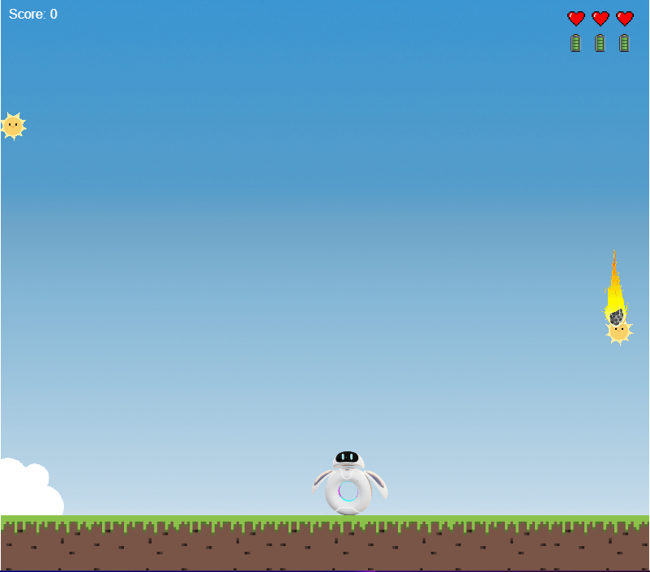
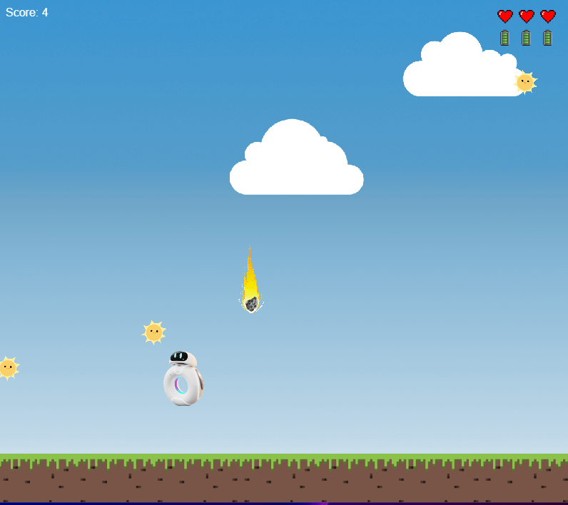
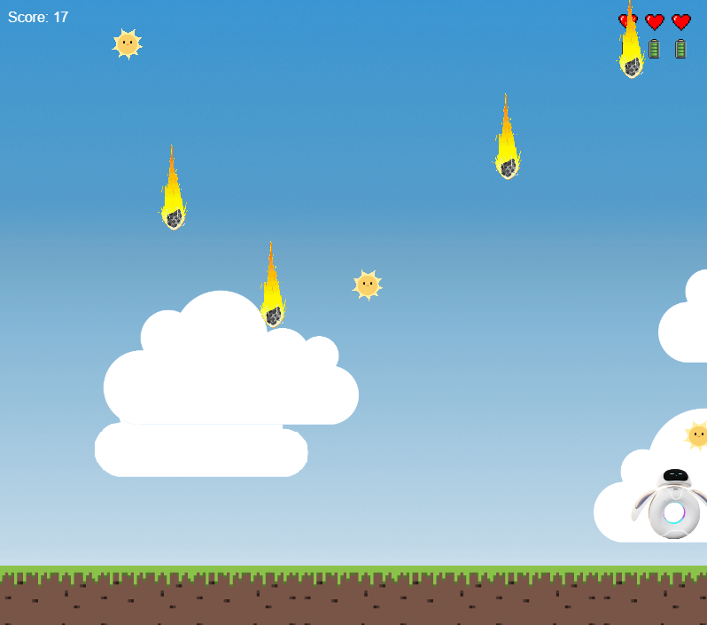

# Ori Game (Phaser 3)

[](https://medeiroz.github.io/ori-game-phaser3)
[](https://github.com/medeiroz/ori-game-phaser3/actions/workflows/deploy.yml)

## Tecnologias Utilizadas


## Sobre

Este repositório contém o código-fonte e recursos para o jogo Ori desenvolvido com o framework Phaser 3. O Ori Game é um jogo de plataforma com belos gráficos e mecânicas envolventes. O objetivo deste jogo é fornecer uma experiência divertida e desafiadora para os jogadores.

## Demonstração

Uma demonstração do jogo está disponível no GitHub Pages. Você pode acessar o jogo clicando [aqui](https://medeiroz.github.io/ori-game-phaser3).

## História

Em um futuro não muito distante, a Terra depende cada vez mais de fontes de energia renováveis. Óri, um robô avançado, foi criado com uma missão importante: coletar a maior quantidade possível de energia solar para ajudar a manter o planeta funcionando. Equipado com três células de bateria e três corações de vida, Óri navega por céus perigosos, onde meteoros caem incessantemente.

Sua tarefa é simples, mas vital: capturar os sois que caem do céu, recarregando suas baterias enquanto desvia dos meteoros que ameaçam sua existência. Cada sol capturado aumenta sua energia e pontuação, mas deixar um sol escapar reduz sua bateria, dificultando ainda mais sua missão. Óri deve ser rápido e habilidoso para sobreviver e continuar ajudando a Terra.

Conforme a jornada avança, o desafio cresce, com meteoros caindo em maior número e velocidade. Ajude Óri a capturar o máximo de energia solar possível e a proteger o futuro do nosso planeta!

## Controles

### Teclado
- **Movimentação:** `A`/`D` ou `⭠`/`⭢`
- **Pulo:** `W` ou `⭡`
- **Agachar:** `S` ou `⭣`

### Celular com giroscópio
- **Movimentação:** Mexer o celular para esquerda ou direita
- **Pulo:** Toque na tela

### Controle Joystick (Xbox / Playstation / Nintendo)
- **Movimentação:** `⭠`/`⭢`
- **Pulo:** `⭡`
- **Agachar:** `⭣`
Ou Analógico 


## Capturas de tela





## Recursos

O jogo utiliza os seguintes recursos e tecnologias:

- [Phaser 3](https://phaser.io/phaser3): Um poderoso framework para desenvolvimento de jogos em JavaScript.
- Sprites e animações de alta qualidade.
- Música e efeitos sonoros envolventes.
- Controles responsivos e intuitivos.
- Mecânicas de jogo desafiadoras.
- Implementação de diferentes níveis e fases.

## Como executar localmente

Para executar o jogo localmente, siga estas etapas:

1. Certifique-se de ter o Node.js instalado em sua máquina.

2. Clone este repositório em sua máquina local usando o seguinte comando:

   ```bash
   git clone https://github.com/medeiroz/ori-game-phaser3.git
   ```

3. Navegue até o diretório do projeto:

   ```bash
   cd ori-game-phaser3
   ```

4. Instale as dependências necessárias executando o seguinte comando:

   ```bash
   npm install
   ```

5. Inicie um servidor local executando o seguinte comando:

   ```bash
   npm run dev
   ```

6. Abra seu navegador e acesse [http://localhost:8222](http://localhost:8222) para jogar o Ori Game.

## Contribuição

Contribuições são bem-vindas! Se você tiver sugestões, correções de bugs ou melhorias para o jogo, fique à vontade para abrir um problema ou enviar uma solicitação pull. Para contribuir:

1. Fork este repositório.
2. Crie uma branch para sua feature (git checkout -b feature/AmazingFeature).
3. Commit suas alterações (git commit -m 'Add some AmazingFeature').
4. Push para a branch (git push origin feature/AmazingFeature).
5. Abra um Pull Request.

## Licença

Este projeto é licenciado sob a licença [MIT](LICENSE). Sinta-se à vontade para usar e modificar o código-fonte para seus próprios projetos.

---

Esperamos que você se divirta jogando o Ori Game! Se tiver alguma dúvida ou problema, não hesite em entrar em contato conosco.

Desenvolvido por Medeiroz
